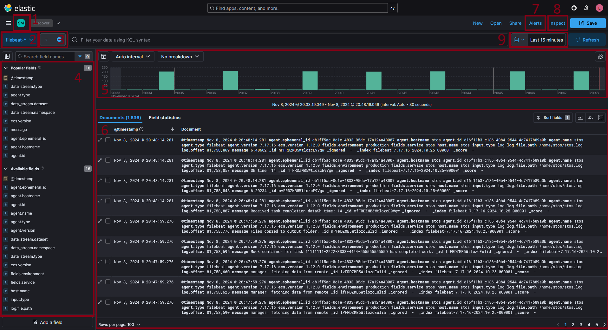

# Elasticstack - instrukcja użytkowania

### Spis treści
1. [Wprowadzenie do platformy](#wprowadzenie-do-platformy)
2. [Konfiguracja modułu Filebeat](#konfiguracja-modułu-filebeat)
3. [Logowanie do środowiska](#logowanie-do-środowiska)
4. [Przegląd logów aplikacji](#przegląd-logów-aplikacji)

### Wprowadzenie do platformy
Platforma [Elasticstack](https://www.elastic.co/elastic-stack) to środowisko opracowane przez firmę Elastic, służące do monitorowania i wizualizacji zdarzeń oraz metryk.
SKłada się z trzech modułów:
* [Elasticsearch](https://www.elastic.co/elasticsearch) - wydajny silnik do przechowywania i przeszukiwania danych.
* [Kibana](https://www.elastic.co/kibana) - moduł do wizualizacji danych.
* [Logstash](https://www.elastic.co/logstash) - moduł przetwarzania danych.

Zestaw modułów jest zainstalowany na serwerze Politechniki Gdańskiej, na dedykowanej maszynie wirtualnej. W celu gromadzenia logów z działającej aplikacji,
należy uruchomić i skonfigurować spedytor [Filebeat](https://www.elastic.co/beats/filebeat).

### Konfiguracja modułu Filebeat
W momencie uruchomienia serwisu Fielbeat poprzez skrypt `~/STOS/deployment/deploy.sh`, pobierana jest konfiguracja z pliku `~/STOS/deployment/filebeat.yml`. Zawiera ona szereg opcji związanych z danymi wejściowymi, wyjściowymi oraz dodatkowymi opcjami. 
#### Konfiguracja wejścia
```yml
filebeat.inputs:
  - type: filestream    # Przesyłane są strumienie plików
    id: stos-logs       # Identyfikator. Przydatny gdy istnieje wiele źródeł
    enabled: true       # Czy wejście jest aktywne
    paths:              # Ścieżki do plików z logami, będące kolekcjonowane przez Filebeat
      - /home/stos/*.log
```
#### Konfiguracja wyjścia
* Wyjście do pliku
```yml
output.file: 
  path: "/home/stos/"           # Ścieżka do pliku wyjściowego
  filename: "filebeat_output"   # Nazwa pliku wyjściowego
```
* Wyjście do serwisu Elasticsearch (preferowane)
```yml
output.elasticsearch:
  hosts: ["http://172.20.3.115:9200"]       # Adres serwera hostującego serwis Elasticsearch 
  username: "${ELASTIC_USERNAME:elastic}"   # Login użytkownika Elasticsearch (z wartością domyślną)
  password: "${ELASTIC_PASSWORD}"           # Hasło użytkownika Elasticsearch
```
#### Konfiguracja dodatkowa
```yml
logging.level: debug    # Poziom istotności przesyłanych logów (debug, info, warn, error)
logging.to_files: true  # Czy logi mają być zapisane w pliku
logging.files:
  path: /home/stos      # Ścieżka do pliku z logami 
  name: filebeat.log    # Nazwa pliku z logami
  keepfiles: 7          # Ilość archiwizowanych plików z logami
  permissions: 0644     # Uprawnienia do pliku z logami
```
Plik filebeat.yml powinien składać się z konfiguracji wejścia, jednej z konfiguracji wyjścia oraz konfiguracji dodatkowej. Obecnie, jest on
dostosowana do działającej platformy Elasticstack na serwerze Politechniki i nie wymgaga zmian.\
Oficjalna Dokumentacja:
* [Konfiguracja - strona główna](https://www.elastic.co/guide/en/beats/filebeat/current/configuring-howto-filebeat.html)
* [Konfiguracja - wejście](https://www.elastic.co/guide/en/beats/filebeat/current/configuration-filebeat-options.html)
* [Konfiguracja - wyjście](https://www.elastic.co/guide/en/beats/filebeat/current/configuring-output.html)

### Logowanie do środowiska
Platrofma Elasticstack działa w sieci wewnętrznej Politechniki, dlatego wymagane jest podłączenie się do niej poprzez VPN lub użycie maszyny, która jest do tej sieci podłączona.
By zalogować się do serwisu Kibana, należy wpisać w adresie wyszukiwarki adres `http://172.20.3.115:5601`. Ukaże się wówczas ekran logowania, w którym należy wpisać przekazane poświadczenia. 

### Przegląd logów aplikacji
W menu nawigacyjnym, znajdującym się po lewej stronie, należy odnaleźć sekcję "Analytics", a w niej opcję "Discover". Po jej wybraniu, ukaże sie panel monitoringu logów, podobny do poniższego widoku.

Objaśnienie wyszczególnionych sekcji:
1. **Przestrzenie (Spaces)** - Są to zbiory logicznie pogrupowanych konfiguracji monitoringu. Mają zastosowanie, gdy monitorowane jest wiele źródeł danych i chcemy je logicznie pogrupować. Początkowo istnieje tylko jedna grupa o nazwie "Stos Monitoring". 
2. **Widoki danych (Data views)** - konfiguracja monitoringu indeksów, wegdług podanego schematu. W implementacji systemu, logi są przesyłane na źródło `filebeat-*`.
3. **Filtry (Filters)** - pozwalają na zarządzanie filtrami logów. Deklaracja filtru polega na przypisania oczekiwanej wartości danego pola za pomocą wygodnego kreatora, lub za pomocą języka KQL (Kibana Query Language).
4. **Widok pól (Fields)** - Lista wszystkich pól wydzielonych z logów. Oprócz samej zawarrtości logów, otrzymujemy również ich metadane, pozwalające na łatwiejszą identyfikację.
5. **Graf wizualizacji danych** - Widok wybranych wartości metryk w czasie. Pozwala na wybranie jednostki czasu oraz podział na wymiary.
6. **Lista logów** - Lista wszystkich otrzymanych logów. Posiada funkcje sortowania, modyfikacji widoku i analizę poszcególnych pól.
7. **Alarmy (Alerts)** - Funkcjonalność pozwalająca na wysyłanie powiadomień w przypadku spełnienia określonego warunku. Wymaga poprawnego skonfigurowania klucza szyfrującego.
8. **Inspekcja (Inspect)** - Panel ze szczegółami wykonywanych zapytań do środowiska Elasticstack.
9. **Przedział czasu** - Przedział czasu w którym były przesłane logi.